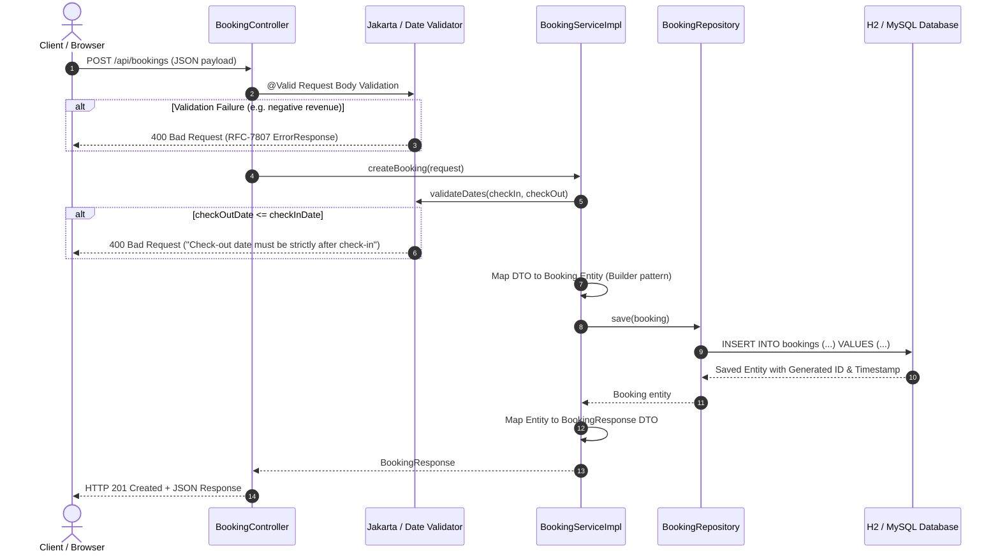

# Hotel Revenue Analytics API — Comprehensive Project Analysis

> **Analysis Date:** August 2026  
> **Framework:** Spring Boot 3.2.3  
> **Language:** Java 22 (LTS compatibility with Java 17+)  
> **Database:** H2 In-Memory (Default) / MySQL 8.0 (Configurable)  
> **Author / Maintainer:** Mohana Prasath R  

---

## 1. Project Structure

The project is structured following clean enterprise **Layered Architecture (Controller-Service-Repository-Entity-DTO)** principles, ensuring separation of concerns, testability, and maintainability.

```
hotel-revenue-analytics-api/
├── pom.xml                                    # Maven dependencies & build configuration
├── README.md                                  # Project overview, setup instructions & API specification
├── PROJECT_ANALYSIS.md                        # Detailed architecture & technical analysis
├── src/
│   ├── main/
│   │   ├── java/com/mohana/hotelanalytics/
│   │   │   ├── HotelRevenueAnalyticsApplication.java   # Spring Boot Application bootstrap entrypoint
│   │   │   ├── config/
│   │   │   │   └── OpenAPIConfig.java                  # OpenAPI 3.0 / Swagger UI metadata bean
│   │   │   ├── controller/
│   │   │   │   ├── BookingController.java              # REST Controller for CRUD booking endpoints
│   │   │   │   └── AnalyticsController.java            # REST Controller for financial & occupancy metrics
│   │   │   ├── dto/
│   │   │   │   ├── request/
│   │   │   │   │   ├── BookingCreateRequest.java       # Request payload validation for booking creation
│   │   │   │   │   └── BookingUpdateRequest.java       # Request payload validation for booking updates
│   │   │   │   └── response/
│   │   │   │       ├── BookingResponse.java            # Response representation of a single booking
│   │   │   │       ├── TotalRevenueResponse.java       # Total revenue and eligible bookings count
│   │   │   │       ├── HotelRevenueResponse.java       # Revenue & count breakdown per hotel property
│   │   │   │       ├── MonthlyRevenueResponse.java     # Time-series monthly revenue breakdown (YYYY-MM)
│   │   │   │       ├── StatusCountResponse.java        # Booking counts grouped by operational status
│   │   │   │       ├── AverageRevenueResponse.java     # Average yield per active booking
│   │   │   │       └── TopHotelResponse.java           # Ranked property revenue performance
│   │   │   ├── entity/
│   │   │   │   ├── Booking.java                        # JPA Entity mapped to `bookings` database table
│   │   │   │   ├── BookingStatus.java                  # Enum: CONFIRMED, CHECKED_IN, CHECKED_OUT, CANCELLED
│   │   │   │   └── RoomType.java                       # Enum: SINGLE, DOUBLE, SUITE, DELUXE, PRESIDENTIAL
│   │   │   ├── exception/
│   │   │   │   ├── ErrorResponse.java                  # RFC-7807 standardized JSON error payload DTO
│   │   │   │   ├── GlobalExceptionHandler.java         # Centralized @RestControllerAdvice exception handler
│   │   │   │   ├── InvalidBookingDatesException.java   # Custom unchecked exception for date validation errors
│   │   │   │   └── ResourceNotFoundException.java      # Custom unchecked exception for 404 entity lookup errors
│   │   │   ├── repository/
│   │   │   │   └── BookingRepository.java              # Spring Data JPA repository with custom JPQL queries
│   │   │   └── service/
│   │   │       ├── BookingService.java                 # Service interface for booking CRUD operations
│   │   │       ├── AnalyticsService.java               # Service interface for revenue & occupancy analytics
│   │   │       └── impl/
│   │   │           ├── BookingServiceImpl.java         # Business logic implementation for reservations
│   │   │           └── AnalyticsServiceImpl.java       # Aggregation & ranking logic implementation
│   │   └── resources/
│   │       ├── application.properties                  # Spring Boot properties (DB, JPA, H2, Swagger)
│   │       ├── application-example.properties          # Environment variable reference template
│   │       ├── data.sql                                # Initial SQL seed script (12 sample hotel bookings)
│   │       └── static/
│   │           └── index.html                          # Embedded visual analytics dashboard (Tailwind + Chart.js)
│   └── test/
│       └── java/com/mohana/hotelanalytics/
│           ├── HotelRevenueAnalyticsApplicationTests.java # Context smoke test
│           ├── controller/
│           │   ├── BookingControllerTest.java          # MockMvc unit tests for BookingController
│           │   └── AnalyticsControllerTest.java        # MockMvc unit tests for AnalyticsController
│           ├── integration/
│           │   └── BookingFlowIntegrationTest.java     # End-to-end integration test with in-memory DB
│           ├── repository/
│           │   └── BookingRepositoryTest.java          # @DataJpaTest verifying JPQL queries
│           └── service/
│               ├── BookingServiceTest.java             # Mockito unit tests for BookingServiceImpl
│               └── AnalyticsServiceTest.java           # Mockito unit tests for AnalyticsServiceImpl
```

---

## 2. How the Application Starts

1. **Entrypoint Execution**:
   - The application launches from [`HotelRevenueAnalyticsApplication.java`](file:///c:/MohanaPrasath.in/hotel-revenue-analytics-api/src/main/java/com/mohana/hotelanalytics/HotelRevenueAnalyticsApplication.java).
   - Marked with `@SpringBootApplication`, which combines `@Configuration`, `@EnableAutoConfiguration`, and `@ComponentScan(basePackages = "com.mohana.hotelanalytics")`.
   - The `main(String[] args)` method invokes `SpringApplication.run(HotelRevenueAnalyticsApplication.class, args)`.

2. **Environment & Property Resolution**:
   - Loads [`application.properties`](file:///c:/MohanaPrasath.in/hotel-revenue-analytics-api/src/main/resources/application.properties).
   - Evaluates environment variables (`DB_URL`, `DB_USERNAME`, `DB_PASSWORD`, `DB_DRIVER`). If none are set, defaults to `jdbc:h2:mem:hotel_analytics_db;DB_CLOSE_DELAY=-1;DB_CLOSE_ON_EXIT=FALSE`.

3. **HikariCP Connection Pool & Hibernate Bootstrapping**:
   - Initializes HikariCP connection pool.
   - Hibernate ORM parses the `@Entity` model ([`Booking.java`](file:///c:/MohanaPrasath.in/hotel-revenue-analytics-api/src/main/java/com/mohana/hotelanalytics/entity/Booking.java)) and automatically creates or updates the `bookings` table via `spring.jpa.hibernate.ddl-auto=update`.

4. **Data Seeding (`data.sql`)**:
   - `spring.sql.init.mode=always` and `spring.jpa.defer-datasource-initialization=true` trigger [`data.sql`](file:///c:/MohanaPrasath.in/hotel-revenue-analytics-api/src/main/resources/data.sql), inserting 12 realistic hotel reservations across 4 properties (*Grand Horizon Resort*, *Royal Palm Haven*, *Starlight Palace Hotel*, *Azure Bay Suites*).

5. **Web Server & Routing Initialization**:
   - Embedded Tomcat web server boots up on port `8080`.
   - DispatcherServlet maps REST endpoints under `/api/bookings` and `/api/analytics`.
   - SpringDoc OpenAPI initializes `/v3/api-docs` and `/swagger-ui.html`.
   - Welcome page mapping registers `src/main/resources/static/index.html` at `http://localhost:8080/`.

---

## 3. Detailed Component Breakdown

### A. Configuration Layer
- **[`OpenAPIConfig.java`](file:///c:/MohanaPrasath.in/hotel-revenue-analytics-api/src/main/java/com/mohana/hotelanalytics/config/OpenAPIConfig.java)**:
  - Defines the OpenAPI 3.0 metadata bean (`customOpenAPI()`), documenting API title, version `1.0.0`, description, author contact, and MIT license.
- **[`application.properties`](file:///c:/MohanaPrasath.in/hotel-revenue-analytics-api/src/main/resources/application.properties)**:
  - Configures server port (`8080`), database credentials with environmental fallbacks, Hibernate SQL logging, H2 web console (`/h2-console`), and OpenAPI paths.

### B. Controller Layer
- **[`BookingController.java`](file:///c:/MohanaPrasath.in/hotel-revenue-analytics-api/src/main/java/com/mohana/hotelanalytics/controller/BookingController.java)** (`/api/bookings`):
  - Exposes standard RESTful operations: `POST` (create), `GET` (list all), `GET /{id}` (by ID), `PUT /{id}` (update), `DELETE /{id}` (delete), and `GET /hotel/{hotelName}` (search by property).
  - Uses `@Valid` for automatic input validation against Jakarta constraints.
- **[`AnalyticsController.java`](file:///c:/MohanaPrasath.in/hotel-revenue-analytics-api/src/main/java/com/mohana/hotelanalytics/controller/AnalyticsController.java)** (`/api/analytics`):
  - Exposes read-only financial query endpoints: `/total-revenue`, `/revenue-by-hotel`, `/revenue-by-month`, `/booking-count-by-status`, `/average-revenue`, and `/top-hotels?limit=N`.

### C. Service Layer
- **[`BookingService.java`](file:///c:/MohanaPrasath.in/hotel-revenue-analytics-api/src/main/java/com/mohana/hotelanalytics/service/BookingService.java) & [`BookingServiceImpl.java`](file:///c:/MohanaPrasath.in/hotel-revenue-analytics-api/src/main/java/com/mohana/hotelanalytics/service/impl/BookingServiceImpl.java)**:
  - Manages booking transactions (`@Transactional`).
  - Enforces date integrity: validates that `checkOutDate` is strictly after `checkInDate`.
  - Performs DTO-to-Entity and Entity-to-DTO mappings.
  - Throws domain exceptions (`ResourceNotFoundException`, `InvalidBookingDatesException`) when validations fail.
- **[`AnalyticsService.java`](file:///c:/MohanaPrasath.in/hotel-revenue-analytics-api/src/main/java/com/mohana/hotelanalytics/service/AnalyticsService.java) & [`AnalyticsServiceImpl.java`](file:///c:/MohanaPrasath.in/hotel-revenue-analytics-api/src/main/java/com/mohana/hotelanalytics/service/impl/AnalyticsServiceImpl.java)**:
  - Executes read-only transactions (`@Transactional(readOnly = true)`).
  - Processes raw relational aggregate tuples (`List<Object[]>`) returned by JPA queries and transforms them into clean, typed response DTOs.
  - Implements dynamic ranking algorithms and rounding logic (`RoundingMode.HALF_UP`).

### D. Repository Layer
- **[`BookingRepository.java`](file:///c:/MohanaPrasath.in/hotel-revenue-analytics-api/src/main/java/com/mohana/hotelanalytics/repository/BookingRepository.java)**:
  - Extends `JpaRepository<Booking, Long>`.
  - Contains custom JPQL queries optimized for financial aggregations (filtering out `CANCELLED` bookings).
  - Supports pagination (`Pageable`) for top-hotel ranking limits.

### E. Entity / Domain Model
- **[`Booking.java`](file:///c:/MohanaPrasath.in/hotel-revenue-analytics-api/src/main/java/com/mohana/hotelanalytics/entity/Booking.java)**:
  - Maps to table `bookings`.
  - Fields: `id` (PK, Identity), `hotelName`, `guestName`, `checkInDate`, `checkOutDate`, `guests`, `roomType` (Enum String), `bookingStatus` (Enum String), `totalRevenue` (`BigDecimal(12,2)`), `createdAt` (`LocalDateTime`).
  - Includes `@PrePersist` hook to automatically set `createdAt` timestamp on entity creation.
- **[`BookingStatus.java`](file:///c:/MohanaPrasath.in/hotel-revenue-analytics-api/src/main/java/com/mohana/hotelanalytics/entity/BookingStatus.java)**:
  - Enum values: `CONFIRMED`, `CHECKED_IN`, `CHECKED_OUT`, `CANCELLED`.
- **[`RoomType.java`](file:///c:/MohanaPrasath.in/hotel-revenue-analytics-api/src/main/java/com/mohana/hotelanalytics/entity/RoomType.java)**:
  - Enum values: `SINGLE`, `DOUBLE`, `SUITE`, `DELUXE`, `PRESIDENTIAL`.

### F. Exception Handling Layer
- **[`GlobalExceptionHandler.java`](file:///c:/MohanaPrasath.in/hotel-revenue-analytics-api/src/main/java/com/mohana/hotelanalytics/exception/GlobalExceptionHandler.java)**:
  - Intercepts exceptions globally using `@RestControllerAdvice`.
  - Converts `ResourceNotFoundException` ➔ `404 Not Found`.
  - Converts `InvalidBookingDatesException` ➔ `400 Bad Request`.
  - Converts `MethodArgumentNotValidException` ➔ `400 Bad Request` with a detailed field-by-field error map (`validationErrors`).
  - Converts unhandled exceptions ➔ `500 Internal Server Error`.
  - Returns standardized RFC-7807 compliant [`ErrorResponse`](file:///c:/MohanaPrasath.in/hotel-revenue-analytics-api/src/main/java/com/mohana/hotelanalytics/exception/ErrorResponse.java) JSON payloads.

---

## 4. Database Being Used

| Attribute | Default Mode (Development / Embedded) | Production / External Mode |
| :--- | :--- | :--- |
| **Engine** | **H2 In-Memory Database** | **MySQL 8.0** |
| **JDBC Driver** | `org.h2.Driver` | `com.mysql.cj.jdbc.Driver` |
| **Connection URL** | `jdbc:h2:mem:hotel_analytics_db;DB_CLOSE_DELAY=-1;DB_CLOSE_ON_EXIT=FALSE` | `jdbc:mysql://localhost:3306/hotel_revenue_db` |
| **Default User** | `sa` | `hotel_user` (or via `DB_USERNAME`) |
| **Web Console** | Available at `http://localhost:8080/h2-console` | N/A (MySQL Workbench / CLI) |
| **DDL Schema Strategy** | `hibernate.ddl-auto=update` (automatically creates tables) | `hibernate.ddl-auto=update` |
| **Initial Seed Data** | Pre-seeded with 12 records via `data.sql` | Pre-seeded on startup via `data.sql` |

---

## 5. Complete REST API Endpoint Specification

### A. Booking Management (`/api/bookings`)

| Method | Endpoint | Description | Request Body | Success Status | Error Statuses |
| :--- | :--- | :--- | :--- | :--- | :--- |
| `POST` | `/api/bookings` | Create new reservation | `BookingCreateRequest` (JSON) | `201 Created` | `400 Bad Request` |
| `GET` | `/api/bookings` | Retrieve all reservations | None | `200 OK` | `500 Error` |
| `GET` | `/api/bookings/{id}` | Get booking by ID | None | `200 OK` | `404 Not Found` |
| `PUT` | `/api/bookings/{id}` | Update existing booking | `BookingUpdateRequest` (JSON) | `200 OK` | `400 Bad Request`, `404 Not Found` |
| `DELETE` | `/api/bookings/{id}` | Delete booking by ID | None | `204 No Content` | `404 Not Found` |
| `GET` | `/api/bookings/hotel/{hotelName}` | Search bookings by hotel name (case-insensitive) | None | `200 OK` | `500 Error` |

### B. Revenue & Analytics (`/api/analytics`)

| Method | Endpoint | Description | Query Params | Response DTO | Sample Response |
| :--- | :--- | :--- | :--- | :--- | :--- |
| `GET` | `/api/analytics/total-revenue` | Cumulative active revenue | None | `TotalRevenueResponse` | `{"totalRevenue": 21930.00, "eligibleBookingsCount": 12}` |
| `GET` | `/api/analytics/revenue-by-hotel` | Breakdown by property | None | `List<HotelRevenueResponse>` | `[{"hotelName": "Starlight Palace Hotel", "totalRevenue": 8550.00, "bookingCount": 3}, ...]` |
| `GET` | `/api/analytics/revenue-by-month` | Monthly time-series trends | None | `List<MonthlyRevenueResponse>` | `[{"yearMonth": "2026-05", "totalRevenue": 1850.00, "bookingCount": 2}, ...]` |
| `GET` | `/api/analytics/booking-count-by-status` | Operational status breakdown | None | `List<StatusCountResponse>` | `[{"bookingStatus": "CHECKED_OUT", "count": 6}, ...]` |
| `GET` | `/api/analytics/average-revenue` | Mean ticket size | None | `AverageRevenueResponse` | `{"averageRevenuePerBooking": 1827.50, "totalBookingsEvaluated": 12}` |
| `GET` | `/api/analytics/top-hotels` | Top ranked properties | `limit` (default: 5) | `List<TopHotelResponse>` | `[{"rank": 1, "hotelName": "Starlight Palace Hotel", "totalRevenue": 8550.00, "totalBookings": 3}, ...]` |

---

## 6. Frontend UI Availability

The project provides multiple frontend interfaces:

1. **Embedded Visual Analytics Dashboard** (`http://localhost:8080/`):
   - Located at [`src/main/resources/static/index.html`](file:///c:/MohanaPrasath.in/hotel-revenue-analytics-api/src/main/resources/static/index.html).
   - Features: Real-time KPI cards, interactive Chart.js line charts (monthly yield), donut charts (operational status), bar charts (hotel comparisons), property leaderboard, search & filter reservations table, and an interactive "+ New Reservation" modal.
2. **Interactive Swagger UI API Explorer** (`http://localhost:8080/swagger-ui.html`):
   - Auto-generated OpenAPI 3.0 documentation allowing live execution of every endpoint directly in the browser.
3. **H2 Database Web Console** (`http://localhost:8080/h2-console`):
   - Direct SQL query interface to inspect database tables, schemas, and indices.
4. **Next.js Portfolio Interactive Showcase** (`/demos/hotel-revenue`):
   - Located at [`app/demos/hotel-revenue/page.tsx`](file:///c:/MohanaPrasath.in/app/demos/hotel-revenue/page.tsx) within the parent portfolio application.

---

## 7. Data Flow: From API Request to Database



---

## 8. Revenue and Occupancy Calculation Algorithms

All financial analytics are calculated dynamically using JPQL queries defined in [`BookingRepository.java`](file:///c:/MohanaPrasath.in/hotel-revenue-analytics-api/src/main/java/com/mohana/hotelanalytics/repository/BookingRepository.java):

### 1. Total Realized Gross Revenue
$$\text{Total Revenue} = \sum_{\text{status} \neq \text{'CANCELLED'}} \text{totalRevenue}$$
- **JPQL:**
  ```sql
  SELECT SUM(b.totalRevenue) FROM Booking b 
  WHERE b.bookingStatus <> com.mohana.hotelanalytics.entity.BookingStatus.CANCELLED
  ```
- **Rationale:** Cancelled bookings represent unrealized revenue and are strictly excluded from financial totals.

### 2. Revenue Breakdown by Hotel Property
- **JPQL:**
  ```sql
  SELECT b.hotelName, SUM(b.totalRevenue), COUNT(b)
  FROM Booking b
  WHERE b.bookingStatus <> com.mohana.hotelanalytics.entity.BookingStatus.CANCELLED
  GROUP BY b.hotelName
  ORDER BY SUM(b.totalRevenue) DESC
  ```
- **Rationale:** Groups revenue per property and orders by total revenue descending to immediately highlight top revenue generators.

### 3. Monthly Time-Series Trends (`YYYY-MM`)
- **JPQL:**
  ```sql
  SELECT SUBSTRING(CAST(b.checkInDate AS string), 1, 7), SUM(b.totalRevenue), COUNT(b)
  FROM Booking b
  WHERE b.bookingStatus <> com.mohana.hotelanalytics.entity.BookingStatus.CANCELLED
  GROUP BY SUBSTRING(CAST(b.checkInDate AS string), 1, 7)
  ORDER BY SUBSTRING(CAST(b.checkInDate AS string), 1, 7) ASC
  ```
- **Rationale:** Extracts the `YYYY-MM` prefix from `checkInDate` to produce chronological time-series aggregations compatible across both H2 and MySQL dialect implementations.

### 4. Operational Status & Occupancy Distribution
- **JPQL:**
  ```sql
  SELECT b.bookingStatus, COUNT(b)
  FROM Booking b
  GROUP BY b.bookingStatus
  ```
- **Rationale:** Evaluates operational load across `CONFIRMED`, `CHECKED_IN`, `CHECKED_OUT`, and `CANCELLED` states.

### 5. Mean Ticket Size (Average Revenue per Active Booking)
$$\text{Average Revenue} = \frac{\sum \text{totalRevenue}}{\text{count of active bookings}}$$
- **JPQL:**
  ```sql
  SELECT AVG(b.totalRevenue) FROM Booking b 
  WHERE b.bookingStatus <> com.mohana.hotelanalytics.entity.BookingStatus.CANCELLED
  ```
- Computed with `BigDecimal` rounding to 2 decimal places using `RoundingMode.HALF_UP`.

### 6. Top N Hotels by Revenue
- **JPQL:**
  ```sql
  SELECT b.hotelName, SUM(b.totalRevenue), COUNT(b)
  FROM Booking b
  WHERE b.bookingStatus <> com.mohana.hotelanalytics.entity.BookingStatus.CANCELLED
  GROUP BY b.hotelName
  ORDER BY SUM(b.totalRevenue) DESC
  ```
- Paginated using Spring Data `PageRequest.of(0, limit)` to return the top $N$ properties.
